# Medical Image Processing (CS:736, IIT Bombay)
This repository contains code and materials for a couple of assignments developed in IITB's course, taken by [Prof. Suyash Awate](https://www.cse.iitb.ac.in/~suyash/).

### Denoising of brain MRI Images
The problem statement can be found [here](./mri_denoising/problem_statement.pdf).

I implemented a denoising system maximum-a-posteriori Bayesian image-denoising algorithm using different priors on the MRF (markov random fields). The different priors, used to enforce smoothness, used the following potential functions:
1. Quadratic function (g1)
2. Discontinuity adaptive huber function (g2)
3. Custom discontunuity adaptive function (g3). More details in the problem statement.

The results on a phantom image are in the following table. The efficacy of the algorithm in removing noise while mainting the edges is clearly visible.

| Description     | Image |
| ---- | ----- |
| Uncorrupted phantom | 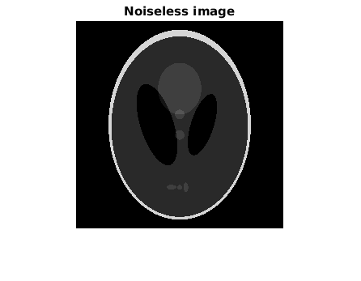 |
| Noisy image (input) | 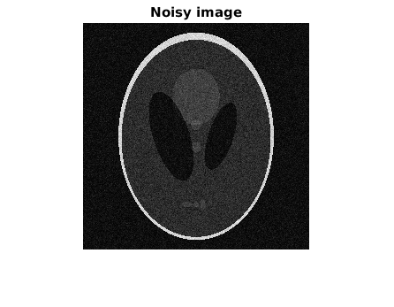 |
| Processed using g1 |  |
| Processed using g2 |  |
| Processed using g3 | 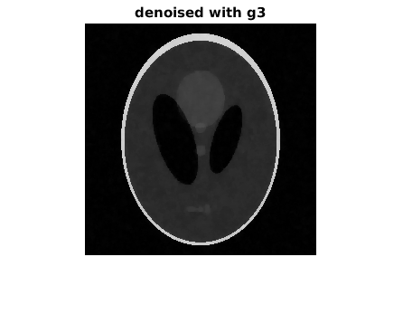 |

The results on an actual 2d image of a brain, corrupted with noise, is shown below.
| Description | Image |
| --------- | ----- |
| Noisy image (input) |  |
| Processed using g1 |  |
| Processed using g2 |  |
| Processed using g3 | 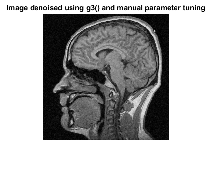 |

### MRI image segmentation
The problem statement can be found [here]((./mri_segmentation/problem_statement.pdf).).

An MRI image contains three segments of interest: *white matter*, *gray matter*, and *cerebrospinal fluid*. The segmentation becomes challenging in the presence of random noise, and the occasional bias field. We implemented two algorithms: modified fuzzy-c-means (FCM), and an expectation-maximization based algorithm on top of a Gaussian mixture model (GMM) on Markov random fields (MRF).

The results are collected in the table below. The FCM algorithm has the ability to handle the bias field. But the EM-GMM algorithm performs better classification.
| Image description | FCM algo | EM-GMM algo |
| --- | --- | --- |
| Input | 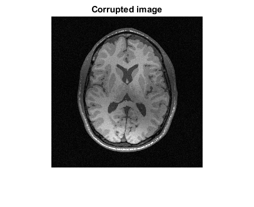 | 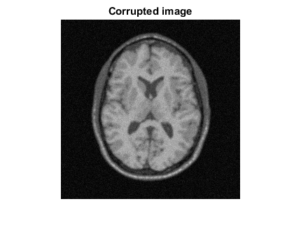 |
| Gray matter | 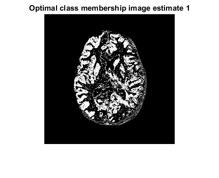 | 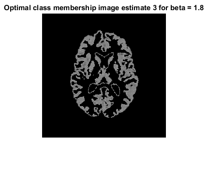 |
| White matter | 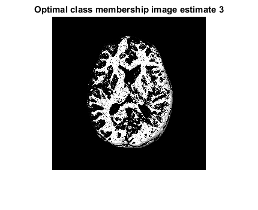 | 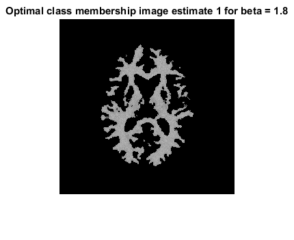 |
| Cerebrospinal fluid | 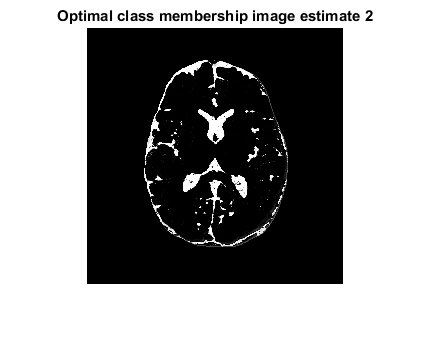 | 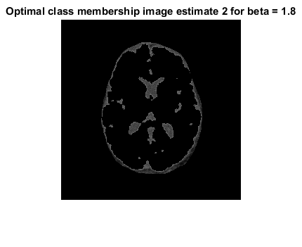 |

